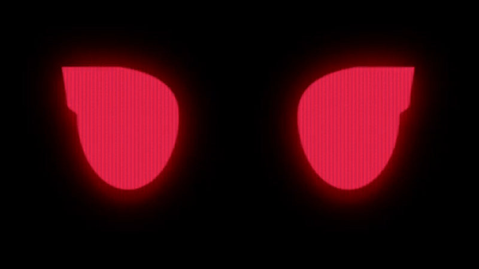

# ^_^  ROBOT EYES O_O
[](https://) 

**Note:** *we threw this together in a night because we couldnt sleep and then cleaned it up a tiny bit for sharing. excuse the mess*

An HTML-based project for animating expressions by morphing between SVGs. it can be run with nodejs for controlling it via a web endpoint or standalone. intended to run on an OLED display inside a robot visor



## Setup
- clone the repository
#### standalone version
- navigate to public and open index.html
#### nodejs version
- install nodejs
- install `express` and `express-SSE`
```
node i express
node i express-SSE
```
- change the nodejs setting to `true` (see the **settings** section)
- run with `node index`

### Adding SVGs
- create your SVG in a vector-based image editor. we used inkscape
- export as .svg
- open the svg in a text editor and copy the line that starts with `d=` *should be right by the bottom*
- open `public/index.html` and find the line starting with `<svg id="leftEye"`
- copy one of the `<path>` tags to a new line
- change d= to the line from your SVG
- change the id to whatever you want your expression to be called
- change the data-button to whatever you want to appear on the button

### Controlling
if you are using the nodejs version, you can control it by pinging `http://[local ip]:[port]/API/set/[emotion]`   
eg: `http://127.0.0.1:3000/API/set/shock`  
or visiting `http://[local ip]:[port]/control.html` for an interface with buttons

### Settings
settings are at the top of `public/main.js`

**nodejs**[false] - enables nodejs  
**color**[0] - rotates the hue of the eyes. number between 0-360   
**blinking**[true] - enabled blinking  
**showControls**[true] - shows buttons for changing emotes
**randomEmotions**[false] - randomly cycle through emotions      
**randomEmotionList**["all"] - an array of emotions to cycle through randomly or "all" for all   
**clickOnEyes**[true] - enables clicking on the left eye for full screen and the right eye for a random emotion
**maskOpacity**[true] - change the flicker amount of the crt mask
**columnOpacity**[true] - change the flicker amount of the crt columns

### TODO
---
- add settings for shake amount
- add color transition
- more effects
    - chromatic abboration? 
    - crt bevel?
- update docs, especially `adding svgs`
- morphing into a singular icon
- extra marks - eg: blushing, frowning
- text scrolling
- display arbitrary pictures


### changelog
---
#### 6/7/26
- added random shake
- added json for svgs, multiple sprite sets, dynamic buttons for interface
- color selection
- blinking animation